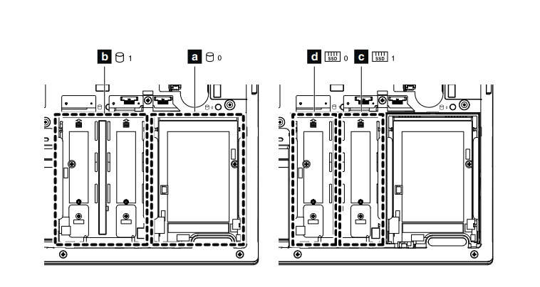

# Replacing laptop SSD

Several (now many) years ago, during a very hot summer spent in Pittsburgh for an internship[^1], my ThinkPad's SSD died one day due to *mysterious water damage*. I am certain it had to do with my desk being right in front of an air conditioner on full blast, with a water bottle covered in condensation next to the laptop. At first, my shell started reporting strange disk errors, an ominous sign. Then, upon reboot, the kernel failed to boot correctly, but I kept pressing on, trying to fix it with various boot settings. Only when I lifted up my laptop and liquid water dripped down did I realize something was seriously wrong. I immediately powered off the laptop, but it was too late. Since that fateful shutdown, the SSD never read again.

This was the only time I've ever lost personal files, although the most important stuff, my code, was safely on Github. Definitely nothing on there was important enough to be worth shelling out a few hundred dollars on a disk recovery service. What makes it worse is that just the previous week I was messing around with disk partitions; I had the perfect opportunity to make backups, but I foolishly skipped doing so! 

Since then, I've been using my laptop's HDD just fine. Startup took about 2 minutes, which I never had a problem with. Starting a large application like Firefox or Codium took a while the first time after bootup, up to 30 seconds, but subsequent starts were much faster due to linux's page cache. Linux has a policy of "unused RAM is wasted RAM", so with my 24 GB of RAM (16 GB from the factory, then I installed 8 GB more a while ago for fun), all my programs were cached and startup times were not a problem for me. Although I've planned it for a while, the impetus for buying the SSD now was probably from reading about current wild AI memory stocks like MU, SNDK, and SKHY. [SK Hynix listed on the NASDAQ on July 10 via ADRs](https://www.reuters.com/world/asia-pacific/sk-hynix-us-listing-more-than-seven-times-oversubscribed-source-says-2026-07-09/), but at a [roughly 30% ADR premium, a huge price difference](https://finance.yahoo.com/markets/stocks/articles/sk-hynix-us-share-premium-053342286.html).

## Steps

Step 0: Backup all my personal files, mainly in `/home`, with rsync to an external drive. I learned my mistake and this time followed the golden rule: always make backups. I had a backup rsync command I saved previously, which excluded `.local/share/Trash/`. From a dry-run, I also excluded `[.]?[cCache]/`, which matches directories like `.cache` and `Cache`, and the infamous `node_modules/`, to cut down on the number of files needing to be transferred, by roughly half in my estimate (not that really matters in this case).

Step 1: Physically install the SSD and tray. Here's the confusing part: the laptop has two bays that each can hold a standard 2.5" HDD, but the left bay can also be used for up to two M.2 SSDs, with the help of a special snowflake Lenovo adapter tray. The very useful ThinkPad manual has the clearest explanation of this, which AI sometimes gets wrong. It's clever, but ThinkPad laptops nowadays have entirely done away with HDDs, which definitely helps with weight. I considered just buying a new laptop since this one has its chassis coating coming off, but computer parts are very expensive nowadays and I still thought this laptop worked fine.

I bought an aftermarket adapter tray on Amazon which came with the correctly sized tray, sponge, and heat spreader (a thin piece of metal). I cheaped out on the SSD and bought a budget Patriot 512 GB SSD for $75, compared to the high-end 1 TB Samsung 970 EVO I have in my desktop build. Patriot Memory is apparently a well-established brand, and the 8 GB RAM stick I installed previously is apparently also a Patriot VIPER brand memory module. I actually installed the SSD module upside down the first time, as I expected the label on the chip to be face up, although afterwards I realized it makes more sense for the chip to be contacting the heat spreader face down.

Step 2: Use GParted live USB to initialize the disk and copy over partitions. A factory new SSD is completely blank memory, so the first thing to do is initialize the partition table as GPT. (Linux can technically work on a raw disk with the filesystem directly on the block device, although I don't know if this can be booted easily, and having a partition table is the default choice.)

Reinstalling Ubuntu and copying over `/home` at a file-system level is probably the easier solution, but I wanted to see if I could get away with directly copying partitions. I don't trust myself to do disk operations directly, so I use GParted. It seems I had to set `boot` flag for the partition again. Because I was copying an ext4 partition, GParted used e2image to copy filesystem structures instead of using dd to copy direct blocks.

Step 3: Fix fstab. The downside of cloning partitions exactly is that Linux can easily become confused by the partitions. After restarting, it seems Linux used /boot/efi correctly from the SSD but afterwards still mounted / from the HDD because the UUIDs are the same. The solution I used is to use `tune2fs -U random` to change the filesystem UUID to a randomly generated one. Then I updated fstab with the new UUID. At this point, GRUB on the SSD partition still needs to be fixed, by mounting the SSD's root filesystem and then special bind mounts for /dev, /proc, /sys, and /run. Then I can chroot into the mount and run grub-install and update-grub to fix whatever GRUB does. 

So now with the SSD installed, bootup and first-time loading of programs, especially Firefox, are faster. I haven't yet tested anything that would really benefit from fast disk, like video editing, but it does make me feel better knowing the laptop is whole again. 

## Addendum

A few weeks later, thinking about memory again, I bought some surprisingly cheap used 8 GB RAM for $20 on eBay to upgrade the 24 GB to a full 32 GB. Nothing I was doing really needed it, but I always like having more memory. This had its own mini-ordeal of installing the RAM making the computer not boot, causing me to initially suspect bad RAM, even though the seller said "Tested and Working". Then I tried many combinations of swapping my RAM sticks, one of which happened to boot, but I couldn't understand why.

The next day I eventually figured out the issue: I was trying to be gentle and didn't shove the RAM all the way in, but SO-DIMM uses springy metal contacts and is designed to go in at an angle, then be pushed downwards flat. I ran a few passes of Memtest86+ in GRUB to thoroughly test it out and give me confidence. The original RAM modules that came installed from the factory are labeled SK Hynix and Kingston, although for the latter Kingston manufactured the module but SK Hynix manufactured the DRAM chips. The first module I installed myself is Patriot branded, but manufactured by SpecTek, a division of MICRON. The eBay module is branded SK Hynix, so overall 3/4 SK Hynix, 1/4 Micron.

[^1]: My office for county government work happened to be just down the street from the David L. Lawrence Convention Center, where Anthrocon is held every summer. I didn't buy a ticket, but I did walk around the public hallways to see what was going on. It was somewhat surreal. It also must've been awful wearing a fursuit in the heat wave weather. The congoers permeate the surrounding area, including the nearby Marriott hotel and local restaurants, some of which have cardboard cutout furry mascots.
